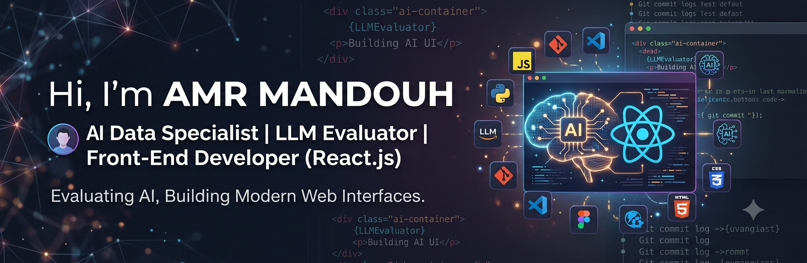

# Hi, I'm Amr Mandouh 👋

## AI Data Specialist | LLM Evaluator | Front-End Developer (React.js)

I'm passionate about Artificial Intelligence, Large Language Models, and Front-End Development.  
I work on improving AI systems through data evaluation, prompt analysis, and quality assessment while building modern web interfaces using React.js.

---

## 🚀 About Me

- 🤖 AI Data Specialist & LLM Evaluator
- 💻 Front-End Developer specializing in React.js
- 🧠 Interested in Generative AI, Prompt Engineering, and AI Model Evaluation
- 🌱 Currently improving my skills in AI workflows and modern web technologies
- ⚡ Love learning new technologies and solving problems

---

## 🛠️ Skills

### Artificial Intelligence
- LLM Evaluation
- Data Annotation
- AI Response Quality Assessment
- Prompt Engineering
- Generative AI

### Front-End Development
- HTML5
- CSS3
- JavaScript (ES6+)
- React.js
- Responsive Design
- REST APIs

### Tools
- Git & GitHub
- VS Code
- Figma
- AI Tools

---

## 📌 Projects

### 🔹 AI & LLM Projects
Coming soon...

### 🔹 React Projects
Coming soon...

---

## 📊 GitHub Stats

---

## 🌐 Connect With Me

- LinkedIn: https://www.linkedin.com/in/amr1mandouh
- GitHub: https://github.com/Amr1Mandouh

---

⭐ Always learning, building, and exploring the future of AI.

